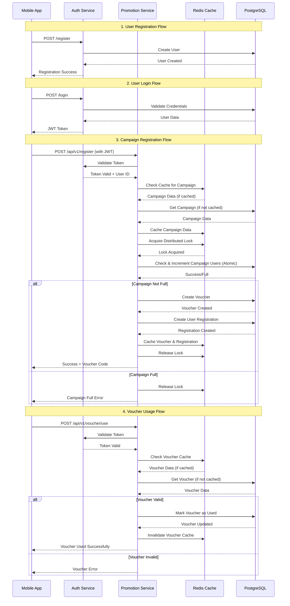
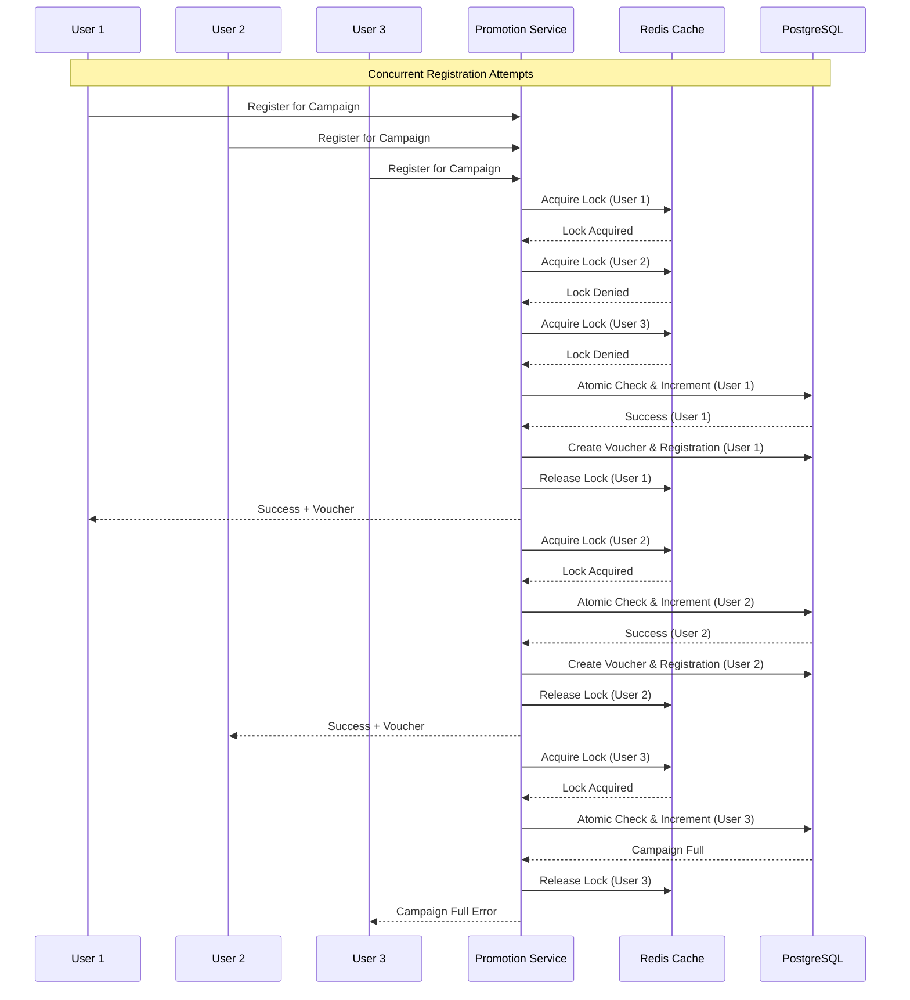
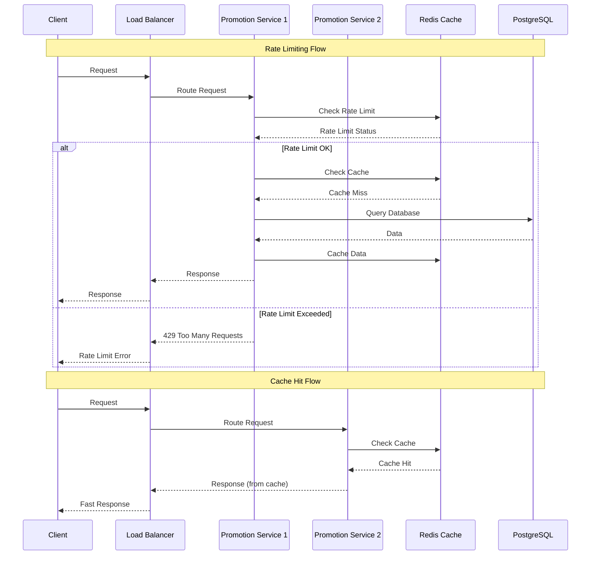
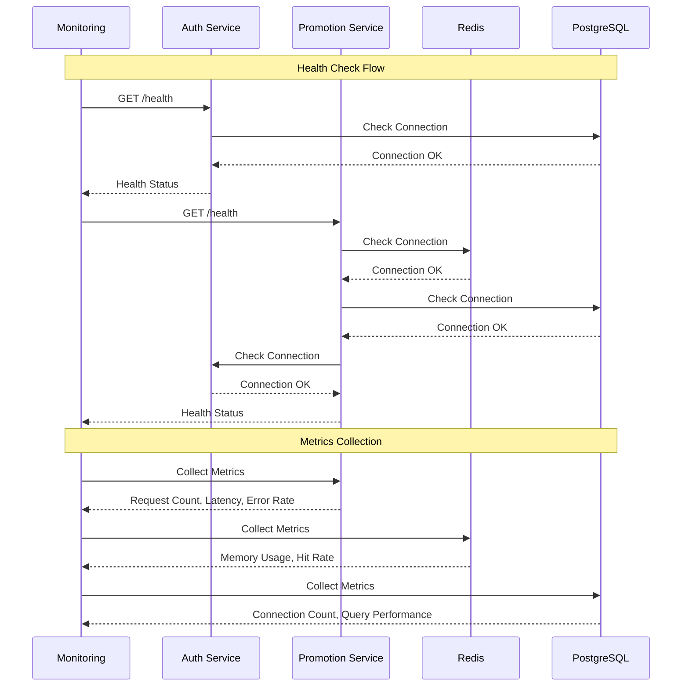

# Promotion System Sequence Diagram

## User Registration and Campaign Participation Flow

## High-Concurrency Campaign Registration

## Rate Limiting and Caching Strategy

## System Health Monitoring

